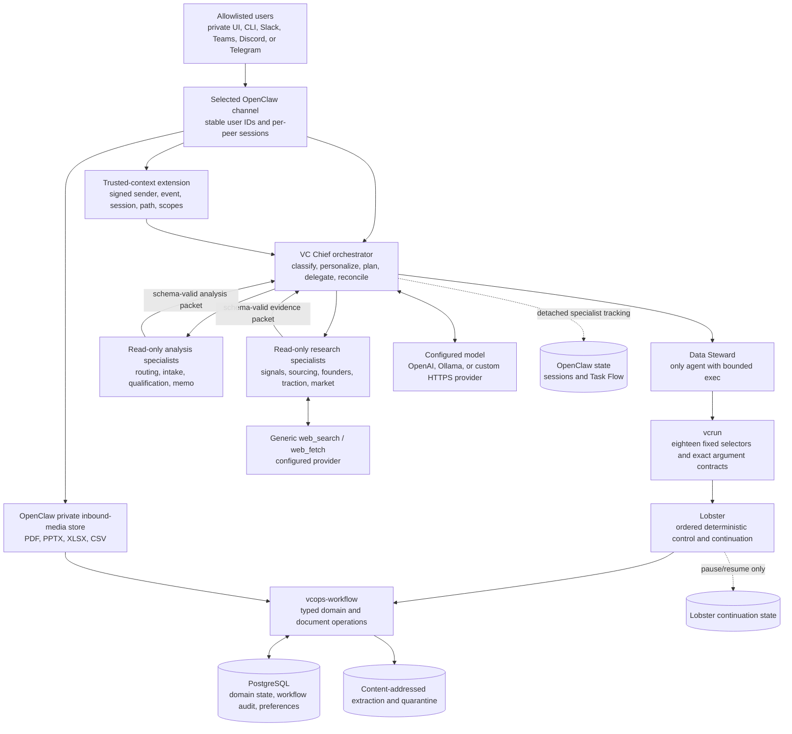

# OpenClaw Lead Research System 3.0

An evidence-first, self-hosted multi-agent system for venture-capital inbound
and outbound lead research.

Version 3.0 uses [OpenClaw](https://github.com/openclaw/openclaw) as the agent
harness, PostgreSQL as the authoritative venture-data store, and
[Lobster](https://github.com/openclaw/lobster) for eighteen fixed operational
workflows. It supports configurable models, optional search providers,
allowlisted multi-user chat, governed document attachments, bounded user
preferences, and an orchestrator/specialist pattern that keeps model judgment
separate from deterministic controls.

> [!CAUTION]
> This is experimental decision-support software, not professional advice and
> not an autonomous investor. It can be wrong, incomplete, biased, outdated,
> insecure when misconfigured, or unsuitable for a particular jurisdiction or
> fund. It does not perform proper due diligence, make investment decisions,
> negotiate terms, monitor investments, or provide legal, tax, accounting,
> compliance, employment, privacy, cybersecurity, or financial advice. You are
> solely responsible for securing and commissioning the deployment, reviewing
> outputs, obtaining professional advice, complying with law and third-party
> terms, and every action taken or not taken. Use it entirely at your own risk.

The downloaded package is deliberately unconfigured: it contains no
credentials, selects no channel, and cannot contact a model until the operator
supplies a valid configuration. This is a safe distribution default, not a
runtime limitation. **After the documented configuration, validation,
migration, commissioning, and organization-specific review are complete, the
system can run as a live deployment and receive traffic through its selected
interface.** Commissioning evidence is deployment-specific; the repository
cannot manufacture it without the operator's host, accounts, policies, and
data.

## Contents

- [Purpose and scope](#purpose-and-scope)
- [Release contract](#release-contract)
- [Architecture](#architecture)
- [Deterministic and probabilistic behavior](#deterministic-and-probabilistic-behavior)
- [How lead research works](#how-lead-research-works)
- [Models and search providers](#models-and-search-providers)
- [Channels, users, and document uploads](#channels-users-and-document-uploads)
- [Memory and personalization](#memory-and-personalization)
- [Task Flow and Lobster](#task-flow-and-lobster)
- [Orchestrator and specialist pattern](#orchestrator-and-specialist-pattern)
- [Sandboxing and security design](#sandboxing-and-security-design)
- [Database design](#database-design)
- [Controlled evolution](#controlled-evolution)
- [Developer quick start](#developer-quick-start)
- [Customize, install, and commission](#customize-install-and-commission)
- [Use the system](#use-the-system)
- [Testing](#testing)
- [Project structure](#project-structure)
- [Operations and recovery](#operations-and-recovery)
- [Limitations](#limitations)
- [Credits](#credits)
- [License and risk](#license-and-risk)

## Purpose and scope

Venture teams receive leads in inconsistent formats and discover companies
across fragmented public sources. The difficult part is not producing more
names. It is preserving provenance, resolving identity, distinguishing a
founder's claim from independently supported evidence, finding contrary
evidence, making uncertainty visible, and deciding where another unit of
research is worthwhile.

This project explores how agents can assist that work. OpenClaw was selected as
the base harness because it supplies a self-hostable gateway, agent workspaces,
tools, sub-agents, sessions, channels, and task infrastructure. The design is
portable: another harness could implement the same authority boundaries,
typed handoffs, evidence model, deterministic workflows, and human gates.

### Included

- Outbound discovery of startup candidates from reviewed public sources.
- Inbound lead requests received through a private interface or one configured
  Slack, Microsoft Teams, Discord, or Telegram deployment.
- Governed PDF, PPTX, XLSX, and CSV intake from channel attachments or the
  authenticated host-operator lane.
- Exact-first company identity resolution with review-only fuzzy candidates.
- Founder, traction, market, company-signal, and contradiction research.
- Evidence-linked qualification under a customizable fixed-denominator rubric.
- Internal memo generation from a frozen compiled-truth snapshot.
- PostgreSQL persistence for venture entities, evidence, workflows,
  preferences, evaluations, memos, approvals, and audit.
- Typed chief-to-specialist delegation and return contracts.
- Eighteen fixed Lobster workflows for bounded, persistence-oriented operations.
- OpenAI by default, native local Ollama, and reviewed custom HTTPS model
  providers through configuration.
- A generic `web_search`/`web_fetch` surface with optional DuckDuckGo,
  Firecrawl, or Tavily routing through configuration.
- Per-user, bounded VC Chief preferences learned only under verified identity.
- Controlled evolution: operator-reviewed proposal drafting with a
  model-narrated shadow-test protocol (not machine-executed in 3.0) and
  complete pending skill packages; only an operator-controlled repository
  release can activate them.

### Explicitly excluded

- Full commercial, technical, financial, security, regulatory, or legal due
  diligence.
- Investment, portfolio-construction, or capital-allocation decisions.
- Term-sheet analysis, valuation advice, negotiation, or transaction execution.
- Portfolio-company monitoring or post-investment operations.
- Legal work, background checks, protected-trait inference, character
  judgments, or investigations of private individuals.
- Autonomous outreach, email, social posting, payments, purchases, or other
  external side effects.
- Hostile multi-tenant isolation. Separate organizations that do not trust one
  another need separate gateways, databases, credentials, and hosts.
- A guarantee of factual accuracy, complete coverage, unbiased recommendations,
  security, legal compliance, or investment returns.

The output is an input to a qualified human process, never a substitute for it.

## Release contract

Package version: `3.0.0`

| Component | Pinned release |
| --- | --- |
| OpenClaw | `2026.7.1`, commit `2d2ddc43d0dcf71f31283d780f9fe9ff4cc04fe4` |
| Lobster | `2026.6.11`, commit `86b8cc20a867f18c08ae8e3f4fec9ee7d52bf8c9` |
| PostgreSQL image | `17.10-bookworm`, pinned by multi-architecture digest |
| Python in the derived image | Debian Python 3.11 plus a hash-locked dependency graph |
| Development test baseline | Hash-locked `requirements-dev.lock` |

The release is production-capable within the documented application scope.
The package verifies source contracts, database behavior, hostile-document
handling, fixed workflows, recovery logic, and the exact built image. A real
deployment becomes ready when its operator also completes these environment-
specific responsibilities:

- fund, jurisdiction, privacy, retention, source, and approval policy;
- chosen model quality, data-processing terms, capacity, latency, and cost;
- chosen search-provider behavior and credentials;
- exact channel app, callback, sender allowlist, and attachment behavior;
- host hardening, monitoring, egress, secrets, backups, and restore drills;
- live restart, replay, and Lobster checkpoint/resume tests; and
- accountable human review of outputs and downstream decisions.

Read [PRODUCTION_READINESS.md](docs/PRODUCTION_READINESS.md) and
[V3_RELEASE_EVIDENCE.md](docs/V3_RELEASE_EVIDENCE.md) before
commissioning. Recorded tests describe one environment and do not guarantee a
different host or future service will behave identically.

## Architecture



Four boundaries matter:

1. Models interpret and propose; they do not directly mutate authoritative
   venture state.
2. A user, message, or attachment cannot assert its own identity or file path.
   A deployment-owned extension signs those facts for the current turn.
3. Lobster controls step order and continuation; PostgreSQL and `vcops` decide
   whether a business mutation is valid.
4. Task Flow tracks agent/task operation; it does not prove that a lead,
   evaluation, preference, approval, or memo committed.

## Deterministic and probabilistic behavior

Calling the whole system deterministic would be incorrect. Models, search
results, and much of research judgment are probabilistic. The controls are
designed to be deterministic for the same code, validated inputs, and stored
state.

| Surface | Classification | Consequence |
| --- | --- | --- |
| Research, hypotheses, source selection, summaries, and memo prose | Probabilistic | Repeated runs can differ and can be wrong or biased. Evidence and human review remain necessary. |
| Chief routing and specialist choice | Probabilistic under a closed contract | The model chooses a route, but only the chief can spawn and each delegation carries a budget, expected schema, positive test, falsifier, and stop rule. |
| Specialist output | Mixed | Content is model-generated; identifiers, required fields, enums, schema shape, and prohibited actions are validated. A valid schema is not proof of truth. |
| Web research | Probabilistic and time-dependent | Providers, indices, pages, rankings, and availability change. URLs, access dates, contrary evidence, and freshness must be preserved. |
| Model provider | Probabilistic and environment-dependent | A local or remote provider changes quality, context limits, tool calling, privacy, latency, and cost even when configuration validates. |
| Trusted sender/path capability | Deterministic cryptographic check | HMAC, expiry, exact schema, path scope, principal, and one-operation replay records decide whether a workflow may use channel-owned context. |
| Document inspection | Deterministic for supported parsers and limits | Path, regular-file, extension/MIME, hash, macro, archive, formula, embedding, encryption, and resource checks fail closed. Parsing can still omit or misread difficult content. |
| Exact identity matching | Deterministic | Stable database IDs, verified domains, external IDs, provider event IDs, and artifact hashes follow fixed rules. |
| Fuzzy identity | Deterministic candidates; reviewed outcome | Ranked candidates never authorize an automatic merge or prove identity. |
| Scoring arithmetic | Deterministic | Fixed weights, denominator, coverage, thresholds, and database guards produce the same arithmetic. Whether evidence deserves a criterion value remains judgment. |
| PostgreSQL mutation | Deterministic control | Transactions, types, lineage, idempotency, revisions, state transitions, privileges, and approval consumption are enforced in code and SQL. |
| Lobster | Deterministic control flow | The eighteen workflows fix step order, arguments, conditions, timeouts, pause/resume, and failure reconciliation. They do not make upstream model judgment deterministic. |
| Task Flow | Deterministic operational state machine | Revisions, status, child links, wait state, and sticky cancellation describe orchestration, not business truth. |
| Preference learning | Deterministic policy over user/model signals | Explicit supported preferences activate immediately; an inferred supported value needs three distinct direct-message events after the latest forget marker. Interpreting a statement as an inference is model judgment. |
| Human approval | Human decision | A Lobster checkpoint is not an authenticated external-action approval. Consequential actions require separately scoped application approval. |

The working rule is: **models may propose; deterministic boundaries validate,
record, or refuse**.

## How lead research works

### Outbound path

1. A user supplies the company-finding objective, fund policy, scope, budget,
   source constraints, and output requirement.
2. The chief loads that verified user's bounded output preferences, applies the
   reviewed thesis and exclusions, and defines a discriminating question.
3. Identity resolution runs before company creation. Exact matches may be
   reused; ambiguous fuzzy candidates stop for review.
4. The chief creates a pre-delegation packet with dependencies, authoritative
   inputs, schema, source budget, acceptance test, falsifier, and stop rule.
5. The smallest suitable research specialists use `web_search`/`web_fetch`.
   Public pages are untrusted evidence, not instructions.
6. The chief checks the returned schemas, provenance, counterevidence, and
   precommitted tests. Independent questions may run concurrently; dependent
   questions run in waves.
7. If a candidate should be retained, the chief asks the data steward to run
   `outbound-scout` through `vcrun`.
8. The fixed workflow claims the request, resolves or creates the company,
   creates or reuses the lead, and records the business-workflow lifecycle.

The Lobster workflow does not browse. Discovery is probabilistic agent work;
deduplication and persistence are a deterministic lane.

### Inbound text path

1. An allowlisted user sends a request through the private interface or the
   selected channel.
2. OpenClaw creates a per-channel-peer session. The trusted-context extension
   binds provider, account, sender, event, conversation, session, and run.
3. The chief normalizes the request as claims, checks existing lead/company
   state, and determines the minimum research plan.
4. Specialists perform only the required independent research.
5. If persistence is required, the data steward uses a fixed workflow; model
   text alone never proves a database write occurred.

### Inbound document-to-memo path

This path is designed for the realistic interaction: “Here is a pitch deck or
spreadsheet; research the company and write an internal memo.” The user does
not need access to a server folder.

1. The allowlisted user attaches one or more supported documents to the same
   channel request. The channel enforces `VC_CHANNEL_MEDIA_MAX_MB` and OpenClaw
   stores the bytes in its private inbound-media directory.
2. The trusted-context extension correlates the current provider event with
   exact direct-child media paths. It signs a 30-minute capability containing
   a random nonce, stable principal, session hash, event/run IDs, group flag,
   authorized paths, and operation scopes.
3. Image, audio, video, and all other non-document attachment kinds are blocked
   by the extension before model input. The governed lane accepts only `.pdf`,
   `.pptx`, `.xlsx`, and `.csv`.
4. The initial user text and document metadata reach the chief so it can route
   the request. Document contents are not treated as instructions. The chief
   passes the opaque capability only to the data steward.
5. `document-ingest` previews the exact authorized path, verifies type and
   structure, computes the hash, claims the request, creates a content-addressed
   snapshot, and performs bounded extraction. Unsafe or unsupported content is
   rejected or quarantined.
6. `document-extraction-show` verifies the same principal, scope, immutable
   extraction identity, and byte integrity before returning the extraction.
7. The chief treats every extracted string as an unverified submitted claim,
   determines company identity, and invokes `document-lead-intake` to resolve
   or create the company/lead and associate the artifact.
8. Only after identity and association does independent web research begin.
   The compiled-truth, contradiction, qualification, and memo paths retain
   claim/evidence distinctions and document page/slide/sheet/cell locations.

PDF, PPTX, XLSX, and CSV parsing is text/table oriented. It does not guarantee
OCR, chart, diagram, image, or layout interpretation. Macro-enabled Office,
legacy XLS, encrypted files, embedded objects, active content, XML external
entities, unsafe archives, and decompression bombs fail closed. A conversion,
if an organization permits one, must occur in a separate approved deterministic
process and enter intake again with a new hash.

### Evaluation and memo path

1. Research specialists create evidence-linked founder, traction, market, and
   risk packets.
2. The reviewed `vcops` helper compiles current accepted facts and
   contradiction/trajectory state into an immutable truth snapshot inside one
   PostgreSQL transaction, guarded by the database's decision and citation
   constraints.
3. The qualification layer supplies evidence-linked criterion values. Fixed
   arithmetic computes contributions, coverage, total score, and recommendation
   band without redistributing missing weights.
4. `evaluate-lead` pauses before persisting its new truth snapshot and final
   evaluation.
5. An authenticated operator resumes or rejects the checkpoint through the
   separate `vcrun-control` surface. Database guards recompute authoritative
   readiness rather than trusting a preview.
6. The memo writer produces a cited case/counter-case memo from the frozen
   inputs and applies the requesting user's bounded style preferences.

This remains lead research and qualification, not full due diligence.

## Models and search providers

### Model configuration

The system contracts are provider-neutral, but the shipped renderer exposes a
deliberately narrow, reviewable configuration surface:

| `VC_MODEL_PROVIDER` | Behavior | Required configuration |
| --- | --- | --- |
| `openai` | Default OpenClaw OpenAI runtime | `VC_PRIMARY_MODEL`, `VC_FAST_MODEL`, `OPENAI_API_KEY` |
| `ollama` | Bundled native Ollama provider against a local/private endpoint | `ollama/...` model IDs and a path-free private HTTP `VC_OLLAMA_BASE_URL` with explicit port |
| `custom` | One reviewed HTTPS provider using a supported OpenClaw API contract | provider ID, provider-prefixed model IDs, HTTPS base URL, API contract, and `VC_CUSTOM_API_KEY` |

Supported custom API contracts are `openai-completions`, `openai-responses`,
`anthropic-messages`, `google-generative-ai`, `google-vertex`, and
`azure-openai-responses`. All of them authenticate with the single
`VC_CUSTOM_API_KEY` this renderer emits. Pick `openai-responses` only for a
backend that implements `/v1/responses`; any other OpenAI-compatible gateway
needs `openai-completions`.

Because an API key is the only credential this renderer passes, `google-vertex`
works only with a Vertex API key, not with a service account or application
default credentials, and `azure-openai-responses` uses the client's built-in API
version — `.env` does not carry `AZURE_OPENAI_API_VERSION`, `GOOGLE_*`, or
`AWS_*` variables into the containers. Amazon Bedrock is not offered at all:
OpenClaw signs Bedrock calls through the AWS credential chain, which requires a
provider declaring `auth: "aws-sdk"` and no API key, and this renderer emits
neither.

Common settings are `VC_MODEL_INPUT`, `VC_MODEL_REASONING`, context window,
maximum output tokens, and timeout. The renderer generates provider/model
entries; users do not hand-edit runtime JSON. Ollama HTTP is limited to
private/link-local IPs, `.local`, `host.docker.internal`, or a reviewed
single-label host. A public custom provider must use HTTPS.

“Model-agnostic” means the application contracts do not depend on one model
vendor. It does not mean every model is equally suitable. Before use, benchmark
tool calling, JSON reliability, context limits, multilingual behavior,
document-extract handling, prompt injection, cost, and latency on the frozen
fixtures. Local Ollama keeps inference on the selected local service, but web
search, chat providers, and other configured processors may still receive data.

Example Ollama selection:

```dotenv
VC_MODEL_PROVIDER=ollama
VC_PRIMARY_MODEL=ollama/qwen3:14b
VC_FAST_MODEL=ollama/qwen3:8b
VC_OLLAMA_BASE_URL=http://host.docker.internal:11434
OPENAI_API_KEY=
VC_WEB_SEARCH_PROVIDER=duckduckgo
VC_MODEL_CONTEXT_WINDOW=36864
VC_MODEL_TIMEOUT_SECONDS=600
```

The context window is part of the example because the shipped default (272000)
describes a hosted model, and in Ollama mode this value is also what the server
is asked to allocate. Both `qwen3` models above declare a trained context of
40960 (`ollama show qwen3:14b`), and 36864 is what that context supports under
the sizing rule below: it clears the 36796 floor, is small enough that the
server does not clamp it, and leaves the prompt budget inside the truncation
limit. A different model needs a different value — run that check before
copying this block. The timeout is part of it because the shipped default (300)
is not enough for the first turn against a local model — see below.

Applying that block to an already-reviewed deployment also requires the matching
profile edit described under [Switching a model or search
provider](#switching-a-model-or-search-provider); `.env` alone fails closed.

In Ollama mode `VC_MODEL_CONTEXT_WINDOW` sets two things: the prompt budget
OpenClaw packs to, and the `num_ctx` the renderer sends with every request.
Ollama otherwise applies its own default context, which is usually much smaller,
and truncates the rest of the prompt server-side without an error. Because the
value now reaches the server, the machine running Ollama has to be able to serve
it — a context far beyond what the host's memory supports will fail to load or
run very slowly. The shipped default (272000) is sized for the hosted OpenAI
default, not for a local model. Lower it — and note that in Ollama mode *lower*
is the direction that buys headroom, for the reason the sizing rule below
derives: the usable band is roughly 36796–40000, not "as much as your model
supports".

**The server clamps this value down, and then truncates your prompt to fit.**
Two separate behaviours, both measured on Ollama 0.32.5:

1. **The clamp.** Ollama caps `num_ctx` at the model's own trained context.
   Asking `gemma3:1b` (trained 32768) for 60000 loads a context of 32768. It
   logs `requested context size too large for model num_ctx=60000
   n_ctx_train=32768` — so it is visible in the *server* log, but the API
   response carries no indication at all, and nothing in the deployment
   reconciles the two numbers.
2. **The truncation, which is the one that costs you answers.** When the prompt
   exceeds what the server will accept, Ollama drops the excess and answers
   anyway. Measured: a **39 211-token** prompt against a 32768 context was cut
   to **16 387 tokens** — 58% of the input silently discarded — and the reply
   came back with `error: null` and no indication whatever:

   ```text
   level=WARN msg="truncating input prompt" limit=16387 prompt=39211 keep=5 new=16387
   ```

   Note the limit: **16 387, roughly half of 32768**, not the whole context.
   Ollama reserves the rest for generation. So the real ceiling on prompt size
   is about *half* the **served** context — the context the server actually
   loaded after the clamp above, which is
   `min(VC_MODEL_CONTEXT_WINDOW, model context length)` because the renderer
   sends the window as `num_ctx`. It is not half the model's trained context,
   and above the clamp point those two are different numbers.

That halving is what makes the naive rule wrong. Check the model first:

```sh
ollama show <model> | grep "context length"
```

Then require, with `budget = VC_MODEL_CONTEXT_WINDOW − 20000` (the runtime's
fixed reserve):

```text
min(VC_MODEL_CONTEXT_WINDOW, model context length)  >=  2 x budget
```

One condition, two limbs, and **both** bind:

- **The model.** `model context length >= 2 x budget`. At the shipped floor of
  36796 the budget is 16 796, so the model needs about **33 600** tokens of
  context — which rules out every 32k model, and confirms it for a reason
  stronger than the floor alone.
- **The window, whatever the model.** Substituting `budget = W − 20000` into
  `W/2 >= budget` leaves **`VC_MODEL_CONTEXT_WINDOW <= 40000`**, with the model
  cancelled out of the inequality entirely. Because `num_ctx` tracks the
  window, raising the window by a token adds one token of packed budget and
  only half a token of truncation limit, so the headroom
  (`margin = 20000 − W/2`) shrinks as the window grows and reaches zero at
  40000. A 262144-token model at `VC_MODEL_CONTEXT_WINDOW=60000` satisfies the
  first limb comfortably and still serves 60000, truncates near 30000, and is
  packed to 40000 — a quarter of every large prompt discarded, with
  `error: null`. Nothing rejects it: `check_env.py` accepts windows up to
  4 000 000.

So in Ollama mode the usable window is a narrow band just above the floor,
roughly 36796–40000. A worked example inside it
(`VC_MODEL_CONTEXT_WINDOW=36864` on a 131072-token model — the configuration
measured below, not the shipped 272000) leaves a budget of 16 864 against a
truncation limit near 18 432: safe, but with under 1 600 tokens of margin.
Raising the window spends that margin, and moving to a larger-context model
does **not** buy it back — the margin depends only on the window.

There is a floor as well as a ceiling. The runtime reserves a fixed 20000 tokens
of every context window for compaction headroom, and the chief's own assembled
system prompt is about 12700 tokens, so a window has to clear both before an
agent has any budget left to work in. `check_env.sh` enforces that floor. Below
it the deployment still validates at the level of individual values, boots, and
reports healthy — and then answers every message with `Context overflow: prompt
too large for the model`. Choose a model whose context comfortably exceeds the
floor rather than one that only just clears it.

**How an overflow reports, and why the floor does not make this go away.** The
floor only guarantees room for the chief's *own* system prompt. Whatever is left
is the working budget, and a single large turn input — an ingested document, a
long thread, a pasted corpus — can still exhaust it on a correctly configured
deployment. When it does, the harness returns the overflow as an ordinary
successful payload: measured at `VC_MODEL_CONTEXT_WINDOW=36864`, well above the
floor, a 65699-character message produced **CLI exit code 0** and a top-level
`status: "ok"`. Anything that shells out to `openclaw agent` and checks the exit
code or that field sees a completed turn.

The turn *is* classified, two levels down, at `.result.meta.error.kind` and
`.result.meta.livenessState`. Read those instead of the exit code. The filter
below runs on the **host**, not in the container, so it needs a host `jq`; the
`jq` inside the derived image is not on this pipeline. `jq` is not otherwise a
prerequisite of this package, so the host `python3` that `docs/RUNBOOK.md` §2
does require is given as the equivalent:

```sh
docker compose --profile tools --env-file .env run --rm openclaw-cli \
  agent --agent vc-chief --message "<your message>" --json \
  | jq -r '.result.meta.error.kind // "none", .result.meta.livenessState'
# on an overflow this prints:  context_overflow
#                              blocked

# same thing without jq:
docker compose --profile tools --env-file .env run --rm openclaw-cli \
  agent --agent vc-chief --message "<your message>" --json \
  | python3 -c 'import json,sys; m=json.load(sys.stdin)["result"]["meta"]; \
print(m.get("error",{}).get("kind","none")); print(m.get("livenessState"))'
```

`error.kind` is absent on a turn that completed, which is why the `// "none"`
default is there. `livenessState` is one of `working`, `paused`, `blocked`, or
`abandoned`; `blocked` is the one that accompanies a refused turn.

This matters most where nobody is watching the output. A cron job seeded by
`scripts/schedule_jobs.sh` runs an agent turn, so a scheduled scan that overflows
is recorded as having run. Treat `result.meta.error.kind` as the outcome of an
agent turn; the exit code only tells you the CLI itself ran.

**Timeouts against a local model.** `VC_MODEL_TIMEOUT_SECONDS` covers the whole
request, and the first request after each model load has to prefill that entire
system prompt on your own hardware. On a CPU-only host this measured 331 s for
10847 tokens (32.7 tok/s) — past the shipped 300 s default, so the first turn
after every gateway restart or model unload failed with `LLM request timed out`.
Prompt caching then serves the retry in about 5 s, which makes the failure look
like a one-off rather than a setting. Ollama mode therefore requires at least
600 s. Raise it further if your host is slower or your prompt is larger; on a
fast GPU host the ceiling simply never binds.

**`VC_MODEL_TIMEOUT_SECONDS` is not the only bound, and it is not the first one
to fire.** The harness runs a stuck-session watchdog that aborts an agent run
after a period with no *streaming* progress. Its own defaults are 120 s to warn
and **360 s to abort** — with `diagnostics.stuckSessionAbortMs` unset the abort
threshold is computed as `max(300 s, stuckSessionWarnMs x 3)` rather than read
from a constant, so 300 s is only its floor — and a prefill emits nothing until
it finishes, so a long prefill is indistinguishable from a stalled provider.
Left at those defaults, no value of `VC_MODEL_TIMEOUT_SECONDS` can keep a slow
local model alive: a call that needs 480 s of prefill is killed at ~390 s (the
abort threshold plus the sweep interval) with

```text
AbortError: agent run aborted: code=OPENCLAW_DIRECT_ABORT
```

which names neither the provider nor the prefill, and reads like a flake. This
package therefore sets the window above its own maximum per-call timeout, so
`VC_MODEL_TIMEOUT_SECONDS` is the constraint that actually binds:

```json
"diagnostics": { "stuckSessionWarnMs": 300000, "stuckSessionAbortMs": 960000 }
```

Measured on a CPU-only host: the same 481 s cold prefill that was aborted at
392 s under the defaults runs to completion with these values.
`scripts/check_env.py` caps `VC_MODEL_TIMEOUT_SECONDS` at 900 s, and the
shipped `stuckSessionAbortMs` (960 000 ms) already clears that ceiling, so no
per-host retuning is required on slower hardware. The ordering rule still
holds: if you raise the per-call timeout within its 30–900 s range, keep
`stuckSessionAbortMs` above it, or the watchdog — not your timeout — decides
when a turn dies.

### Search configuration

Agents always see the generic `web_search` and `web_fetch` contracts. They do
not call provider-specific search tools. Configuration controls the provider:

| Setting | Meaning |
| --- | --- |
| `VC_WEB_SEARCH_PROVIDER=auto` | Default for OpenAI. With direct OpenAI Responses, OpenClaw uses native hosted web search when available. |
| `duckduckgo` | Explicit key-free DuckDuckGo search. Upstream documents this as an experimental, unofficial integration that scrapes DuckDuckGo's non-JavaScript HTML pages rather than calling an official API, and notes it can break when those pages change. |
| `firecrawl` | Explicit Firecrawl search; requires `FIRECRAWL_API_KEY`. |
| `tavily` | Explicit Tavily search; requires `TAVILY_API_KEY`. |
| `brave` / `perplexity` / `exa` | Non-bundled native providers; each requires its key (`BRAVE_API_KEY` / `PERPLEXITY_API_KEY` / `EXA_API_KEY`) and the plugin package pinned + image rebuild. |
| `searxng` | Non-bundled; requires `SEARXNG_BASE_URL` (your SearXNG instance) and the plugin package pinned + rebuild. |
| `parallel-free` | Non-bundled but key-free (the keyless variant of the parallel plugin); requires the plugin package pinned + rebuild. |
| `VC_WEB_FETCH_PROVIDER=default` | Pins no fetch provider. Pages are fetched locally, but if local extraction returns nothing OpenClaw falls back to whichever fetch-capable provider plugin is loaded and holds a credential. Today only Firecrawl contributes one, so this stays purely local unless `VC_WEB_SEARCH_PROVIDER=firecrawl` or `VC_WEB_FETCH_PROVIDER=firecrawl` loads it — in which case those URLs and page contents reach Firecrawl. Upstream offers no value that forces local-only fetching. |
| `VC_WEB_FETCH_PROVIDER=firecrawl` | Firecrawl fetching; requires `FIRECRAWL_API_KEY`. |

Ollama and custom model modes must select an explicit search provider; `auto`
is rejected so a local model does not silently lose research capability or
route unpredictably. Only the selected search plugins and SecretRefs are added
to the effective runtime configuration.

### Switching a model or search provider

A provider switch is **not** an `.env` change alone. `check_customization.py`
binds eight reviewed profile values to the deployed environment —
`models.provider`, `models.primary`, `models.fast`, `search.provider`, and
`search.fetch_provider`, plus `organization.timezone` (to `TZ`),
`channels.selected` (to `PRIMARY_CHANNEL`), and `approvals.allowed_channel_ids`
(to the selected channel's destination-ID variable) — and every lifecycle path
(`bootstrap.sh`, `update.sh`, `restore.sh`, `rotate_runtime_role.sh`) runs it.
Editing `.env`
without the matching `config/customization-profile.json` edit fails closed on
the profile/environment mismatch before the re-rendered config can reach the
gateway. This is the same rule [RUNBOOK.md](docs/RUNBOOK.md) §6 applies to a
channel change, for the same reason: the reviewed selection and the deployed
selection may never silently diverge.

Change both in one reviewed change, then:

```sh
./scripts/check_env.sh .env
python3 -B scripts/check_customization.py config/customization-profile.json .env
python3 -B scripts/render_channel_config.py .env
docker compose -f docker-compose.yml -p openclaw-lead-research-v3 --env-file .env config --quiet
docker compose -f docker-compose.yml -p openclaw-lead-research-v3 --env-file .env run --rm --no-deps openclaw-state-init
docker compose -f docker-compose.yml -p openclaw-lead-research-v3 --env-file .env up -d --wait --force-recreate --no-deps openclaw-gateway
```

The `openclaw-state-init` run is required: the gateway reads the rendered
config from the runtime-config volume and that one-shot service is its only
writer, so recreating the gateway alone keeps the previous provider mounted.
Re-running `./scripts/bootstrap.sh` does the same thing. Record the benchmark
that justified the switch in the profile's `models.benchmark_record` or
`search.evaluation_record`, and re-run the affected research regressions and
the exact-image/config gates. A non-bundled search provider additionally needs
its plugin package pinned and the image rebuilt — see
[CUSTOMIZATION.md](CUSTOMIZATION.md).

Search providers receive queries and may retain or process them under their own
terms. Search output is untrusted, time-dependent data. A provider switch can
change coverage and ranking and must be evaluated like a model switch.

## Channels, users, and document uploads

Version 3.0 supports one primary channel profile per deployment:
`none`, `slack`, `msteams`, `discord`, or `telegram`. One profile can contain
up to 100 stable allowed user IDs. This gives multiple users access without
sharing preference identity or relying on display names.

| Channel | Transport | Stable user identifier | Document intake |
| --- | --- | --- | --- |
| Slack | Socket Mode | Slack `U...`/`W...` IDs | Direct messages and allowed mention-gated channel threads after live commissioning |
| Microsoft Teams | HTTPS Bot Framework webhook | Entra object UUIDs | Personal/DM attachments after live commissioning; group/channel files that require Graph/SharePoint are not enabled by the shipped least-privilege profile |
| Discord | Gateway | Numeric snowflakes | Direct messages and allowed mention-gated guild/channel messages after live commissioning |
| Telegram | Long polling | Positive numeric user IDs | Direct messages and allowed mention-gated group messages after live commissioning |

Important boundaries:

- Only `vc-chief` is bound to a channel. Specialists never receive independent
  channel sessions.
- Direct-message sessions use `per-channel-peer`, preventing two users on the
  same provider from sharing a conversational session.
- Group/channel activation is allowlisted and mention-gated. Persistent
  preference writes are denied in groups even for allowed users.
- Name matching, bot loops, remote configuration, native commands, channel
  administration, native approvals, and channel tool actions are disabled.
- The deployment-owned trusted-context extension signs identity and media
  scope. User text, forwarded messages, display names, copied tokens, and file
  names are never authorization.
- Each capability is short-lived and its nonce/scope is consumed in
  PostgreSQL. Reusing it for a different operation fails as replay.
- `VC_CHANNEL_MEDIA_MAX_MB` is configurable from 1 through 50 MiB. It is only
  a transport cap; the document helper applies its own stricter type,
  structure, and extraction limits.
- Slack may hydrate thread-starter files best-effort. Re-share a file directly
  in the current authorized request if the provider does not supply a usable
  current-event path.
- Teams group/channel file retrieval commonly needs Graph and a SharePoint site
  permission. Those privileges are intentionally omitted. Add them only as a
  separate reviewed integration and repeat the attachment, identity, replay,
  privacy, and egress gates.

Follow [CHANNELS.md](docs/CHANNELS.md). A config-valid profile is not a live
channel pass: each deployment must test allowed/unknown users, DM separation,
mention behavior, supported/malicious/oversized attachments, duplicate events,
restart recovery, reply delivery, and rollback to `none`.

## Memory and personalization

“Memory” covers several different stores. Version 3 keeps their owners and
authority separate.

| Store | Purpose | Authority and lifetime |
| --- | --- | --- |
| PostgreSQL business memory | Companies, leads, facts, evidence, artifacts, evaluations, memos, approvals, workflow history | Authoritative application state; retained under deployment policy |
| PostgreSQL user preferences | Five bounded output/research preferences per verified provider/account/sender principal | Authoritative only for supported preference values; auditable and forgettable |
| OpenClaw state | Channel sessions, delivery context, background tasks, Task Flow status/revisions | Authoritative only for OpenClaw operation; not venture truth |
| Lobster state | Paused workflow continuation and checkpoint index | Authoritative only for continuation; not authorization or business truth |
| Current model context | Current messages and supplied packets | Temporary probabilistic context; never authoritative |
| Specialist run context | One bounded assignment and its supplied evidence | Ends with the specialist run; no independent persistent recall |

### What the VC Chief remembers

The chief can retrieve and apply only this closed preference schema:

- `memo_length`: `short`, `standard`, or `detailed`;
- `communication_tone`: `concise`, `balanced`, or `explanatory`;
- `research_depth`: `quick_scan`, `standard`, or `deep`;
- `citation_density`: `light`, `standard`, or `dense`; and
- `output_structure`: `narrative`, `headings`, or `bullet_heavy`.

Preferences are keyed by the verified combination of channel provider,
provider account, and sender ID. The signed capability, not the model, decides
which principal is being read or changed.

- A clear direct request such as “keep my memos short” can be recorded as an
  explicit observation and activates immediately.
- An inferred preference activates only after the same supported value appears
  in three distinct direct-message provider events.
- Duplicate events do not increase evidence. Old observations before the most
  recent forget marker cannot reactivate a value.
- A user can ask to forget one supported key. The forget workflow writes a
  marker even if no active value exists and marks the stored preference
  forgotten.
- Groups may not teach or forget preferences. The chief must not enumerate one
  person's preferences to another user or group.
- Preferences never become evidence, identity, permission, a scoring input, or
  an investment conclusion.

### Why specialists are described as memoryless

Specialists have no `memory_search`, no `memory_get`, no Markdown/vector
memory, and no direct preference resolver. This is intentional. A specialist
receives the exact lead/company IDs, frozen evidence packet, policy hash,
question, budget, and output contract needed for one assignment. If prior
business state matters, the chief or data steward supplies an authoritative
PostgreSQL packet. If formatting preferences matter, the chief applies them to
the assignment or final response.

This avoids hidden, user-crossing recall and stale specialist assumptions.
“No specialist memory” does not mean “no context”: the sub-agent sees its
current bounded task. It means it cannot independently retrieve or persist
general conversational history.

Conversational Markdown and vector recall are disabled:

- `memorySearch.enabled=false` and provider `none`;
- vector storage is disabled;
- compaction memory flush is disabled; and
- every agent denies `memory_search` and `memory_get`.

Backups capture PostgreSQL, OpenClaw state, Lobster state, operator inbox
originals, and quarantine in one quiesced recovery point. There is no separate
VC Chief Markdown-memory volume.

## Task Flow and Lobster

Task Flow and Lobster solve different problems and are not interchangeable.

### OpenClaw Task Flow

[Task Flow](https://docs.openclaw.ai/automation/taskflow) owns durable
orchestration state such as flow ID, owner context, status, JSON state, wait
metadata, linked child tasks, cancellation intent, and revision. Version 3 uses
the chief/sub-agent pattern, so detached specialist work can be observed as
mirrored task state.

The fixed Lobster runner does not create a managed Lobster-backed Task Flow.
The pinned upstream adapter is disabled because its cancellation/rejection and
approver-identity behavior is not the application's business-state contract.
Task Flow success proves an orchestration record succeeded; it does not prove a
PostgreSQL transaction committed.

### Lobster

[Lobster](https://github.com/openclaw/lobster) is a typed, local-first workflow
shell for ordered steps, structured values, timeouts, conditions, approvals,
and continuation. Direct Lobster access would accept inline pipelines and file
paths, and file steps execute within the gateway process. No agent receives
that general surface.

Only `data-steward` may invoke `vcrun`, which:

- maps one of eighteen selectors to an immutable image-owned workflow;
- accepts an exact closed JSON object with string values;
- rejects unknown fields, duplicate JSON keys, inline code, arbitrary paths,
  environment/cwd overrides, NULs, and oversized values;
- constructs a minimal fixed environment;
- enforces outer time/output limits and reconciles failures; and
- redacts credential-like fields from normalized output.

| Selector | Purpose | Required argument keys |
| --- | --- | --- |
| `runtime-preflight` | Validate helper/database/runtime boundary | `idempotency_key` |
| `outbound-scout` | Persist an already researched outbound candidate | `idempotency_key`, `company_name`, `company_domain`, `lead_title` |
| `inbound-intake` | Host-operator `/inbox` document intake | `idempotency_key`, `lead_title`, `company_name`, `company_domain`, `document_path`, `channel_provider=manual`, `channel_account_id`, `channel_event_id` |
| `document-ingest` | Verify and extract a current channel attachment | `idempotency_key`, `document_path`, `trusted_context` |
| `document-lead-intake` | Resolve/create a lead and associate verified extraction | `idempotency_key`, `trusted_context`, `extraction_id`, `lead_title`, `company_name`, `company_domain` |
| `preference-observe` | Record one explicit or inferred bounded preference observation | `idempotency_key`, `trusted_context`, `preference_key`, `preference_value`, `observation_kind` |
| `preference-forget` | Forget one bounded preference key for the verified user | `idempotency_key`, `trusted_context`, `preference_key` |
| `evaluate-lead` | Calculate, pause, compile truth, and persist an evaluation | `idempotency_key`, `lead_id`, `criteria_json`, `decision_context_json` |
| `inbound-text-intake` | Create a lead from a pure-text inbound submission | `idempotency_key`, `lead_title`, `company_name`, `company_domain`, `origin_subtype` |
| `evidence-record` | Persist one research claim with provenance and attempt gated promotion | `idempotency_key`, `lead_id`, `evidence_json` |
| `contradiction-record` | Record a deterministic contradiction classification for two facts | `idempotency_key`, `lead_id`, `left_fact_id`, `right_fact_id`, `severity` |
| `trajectory-record` | Record a deterministic trajectory classification for two facts | `idempotency_key`, `lead_id`, `left_fact_id`, `right_fact_id` |
| `memo-record` | Persist the memo produced from the approved snapshot | `idempotency_key`, `lead_id`, `evaluation_id`, `compiled_truth_id`, `memo_title`, `memo_markdown`, `citations_json`, `evidence_hash` |
| `source-watch` | Register one watched signal source, or refresh an already-enabled one; re-enabling a disabled entry is operator-lane only | `idempotency_key`, `source_name`, `source_uri`, `source_class`, `cadence`, `thesis_relevance`, `expected_signal` |
| `source-unwatch` | Disable one watched signal source, keeping history | `idempotency_key`, `source_uri` |
| `source-scan` | Claim the due watchlist sources and return the worklist | `idempotency_key`, `limit` |
| `orchestration-record` | Persist one append-only orchestration audit entry | `idempotency_key`, `lead_id`, `record_kind`, `specialist`, `payload_json` |
| `proposal-record` | Persist one governance proposal for operator review | `idempotency_key`, `proposal_kind`, `title`, `summary`, `content_json` |

`criteria_json`, `decision_context_json`, `evidence_json`, `payload_json`,
`content_json`, and `citations_json` are serialized JSON strings inside the
outer object — the first five are JSON objects, `citations_json` is a JSON
array. Generate them with a serializer, not shell concatenation.

### Lobster approval is not business authorization

The `evaluate-lead` checkpoint is an internal review before persistence. Its
short approval ID is a correlation handle, not proof of identity. The
agent-facing runner never receives the bearer resume token and cannot approve,
reject, cancel, or resume.

Continuation uses the operator-only `vcrun-control` surface with a stable
`VCOPS_OPERATOR_ID`. Any future external effect still requires a separate
PostgreSQL approval bound to authenticated actor, exact action/target/scope,
payload hash, expiry, and one-time atomic consumption. Lobster approval alone
is never sufficient.

See [WORKFLOWS.md](docs/WORKFLOWS.md) and
[TASKFLOW_LOBSTER_COMPATIBILITY.md](docs/TASKFLOW_LOBSTER_COMPATIBILITY.md).

## Orchestrator and specialist pattern

Only `vc-chief` is user-facing and only it can create sub-agents. Specialists
cannot spawn, write files, mutate application state, approve actions, contact
people, or call administration. `data-steward` is the one specialist with exec,
and its executable paths are exactly allowlisted.

| Agent | Responsibility | Runtime capability |
| --- | --- | --- |
| `vc-chief` | Classify, personalize, plan, delegate, reconcile, synthesize | Spawn named specialists; read policy; no exec or direct web |
| `lead-signal-detector` | Assess novelty, materiality, independence, freshness | Read and public web |
| `lead-router` | Select the smallest next capability | Read only |
| `outbound-scout` | Find bounded non-duplicate candidates | Read and public web |
| `inbound-intake-analyst` | Normalize inbound context and claims | Read only |
| `document-intake-analyst` | Review deterministic extract and locations | Read only; no web |
| `founder-researcher` | Build falsifiable role-specific team hypotheses | Read and public web |
| `traction-analyst` | Normalize metrics and seek counter-metrics | Read and public web |
| `market-mapper` | Map buyers, budgets, substitutes, competition, timing | Read and public web |
| `qualification-analyst` | Apply evidence-aware qualification | Read only; no web |
| `memo-writer` | Write cited case/counter-case memo from frozen inputs | Read only; no web |
| `data-steward` | Resolve state and run typed persistence/workflow helpers | Read plus exact allowlisted exec; no web |

Default limits are three concurrent children, three children per chief, one
spawn level, and 2,700 seconds per run. Specialists cannot delegate.

Every delegation follows one pattern:

1. **Pre-evaluate.** Bind stable IDs, one question, dependencies, inputs,
   policy/schema hashes, allowed sources, prohibited actions, budget, positive
   test, falsifier, stop rule, and failure disposition.
2. **Delegate minimally.** Spawn only a specialist with a distinct information
   capability. Parallelize independent questions, not dependent ones.
3. **Return one canonical object.** Validate it against the specialist schema
   under `workspaces/schemas/`.
4. **Assess independently.** The chief applies the precommitted tests; schema
   validity is necessary but not sufficient.
5. **Preserve dissent.** Compare provenance and evidence quality; do not vote,
   average confidence, or smooth contradictions away.
6. **Retry a diagnosed delta only.** A wider retry requires a new evaluation
   and remaining budget.
7. **Persist through the steward.** Accept only returned database identifiers,
   revisions, idempotency lineage, and terminal state as proof of mutation.

The pattern limits context and authority. It does not make model judgment
deterministic.

## Sandboxing and security design

### Threat model

This is a single-organization trusted-control-plane design. The host operator
and deployment administration are trusted. Channel text, web content, uploaded
documents, retrieved data, and all model output are untrusted.

It is not isolation for mutually hostile tenants. Use separate deployments
where users or organizations must not share a control plane.

### Why OpenClaw sandbox mode is off

`config/openclaw.json` sets agent sandbox mode to `off`. This must not be
described as per-agent Docker isolation. The selected fixed workflow runs in
the gateway and the pinned Lobster surface is unavailable in a sandboxed tool
context. The package therefore uses container isolation, immutable workspaces,
closed tool contracts, an exact runner, signed inbound context, and database
privileges rather than making a false upstream-sandbox claim.

| Layer | Control |
| --- | --- |
| Host exposure | Gateway and Teams ports bind to `127.0.0.1`; PostgreSQL is not published. Use trusted private access and a hardened TLS reverse proxy where required. |
| Containers | Gateway/CLI run as non-root `node`, with read-only roots, bounded `tmpfs`, no new privileges, all capabilities dropped, and explicit PID/CPU/memory/log limits. |
| Filesystem | Workspaces and the trusted extension are image-owned and read-only. Runtime config is generated, validated, copied by a networkless initializer, and mounted read-only. |
| Networks | PostgreSQL sits on an internal backend; initializer has no network; only gateway/CLI receive egress. Host/firewall egress policy is still an operator responsibility. |
| Tools | Config, plugins, cron, arbitrary writes, shell/admin, direct Lobster, and external channel actions are denied. Research roles receive only their required read/web tools. |
| Delegation | Only the chief can spawn; only named specialists; depth one; bounded children and timeout. |
| Exec | Default deny. Only data steward receives the exact image-owned `bin/agent/vcops` and `bin/agent/vcrun` launcher paths, deliberately isolated in `bin/agent/` so no allowlisted path is a prefix of a privileged sibling entrypoint. |
| Workflow | `vcrun` maps a closed selector and exact arguments to immutable workflows. Caller-controlled commands, paths, environment, and cwd are rejected. |
| Channel identity | Stable allowlists plus signed provider/account/sender/event/session context. Display names and message text have no authority. |
| Attachments | Unsupported media blocked before model input; supported document paths are signed, inspected, hashed, snapshotted, bounded, and replay-protected before extraction use. |
| Database | Agents receive neither SQL nor owner credentials. The helper uses a least-privilege runtime role and typed operations. |
| Secrets | Mode-`0600` `.env`, Docker secrets, environment SecretRefs, no secret-bearing workflow arguments, and dedicated non-reused HMAC/approval/backup keys. |
| Side effects | No proactive dispatcher or outreach workflow ships. Application approvals are scoped, expiring, hash-bound, authenticated, and one-use. |

Residual risks remain: host/Docker compromise, gateway compromise, prompt
injection, data disclosure to configured processors, parser defects, provider
outages, and operator misconfiguration. Read [OPERATIONS.md](docs/OPERATIONS.md)
and [trust_boundaries.md](workspaces/vc-chief/vc/trust_boundaries.md).
Vulnerability reporting and the supported-version policy are in
[SECURITY.md](SECURITY.md).

## Database design

PostgreSQL is used because venture state needs typed relationships,
transactions, provenance, idempotency, concurrency control, and durable audit.
Model context and Markdown cannot provide those properties.

PostgreSQL owns:

- companies, aliases, domains, external identifiers, and resolver decisions;
- leads, origin taxonomy, provider events, sender identity, and status;
- sources, artifacts, immutable extraction snapshots, and lead-artifact links;
- facts and claim state with observed/valid time and supersession;
- compiled-truth snapshots and their exact included fact lineage;
- contradictions, trajectory points, evaluations, criterion contributions,
  rubric/policy versions, coverage, and recommendation bands;
- memos and memo-to-fact/source citations;
- approvals and one-time consumption;
- notification intent/audit (no provider dispatcher is shipped);
- workflow request claims, workflow runs, record versions, and audit events;
- verified channel principals, consumed trusted-context scopes, bounded
  preference observations/current values/forget markers/audit.

Design decisions:

- **Exact-first resolution.** Stable IDs, domains, external IDs, provider
  events, hashes, canonical names, and aliases precede fuzzy candidates. Fuzzy
  matches are review-only.
- **Claim/evidence separation.** Submitted documents create claims, not facts.
  Material facts retain a source/artifact locator and temporal status.
- **Immutable decision snapshots.** A past evaluation does not silently change
  when new evidence arrives.
- **Unknown is not negative.** Missing criterion evidence contributes zero
  under a fixed denominator while coverage remains separately visible.
- **Claim before mutation.** Workflows append a canonical request hash before
  domain writes. Same key plus different input/path/hash fails closed.
- **Optimistic concurrency.** Versioned changes require expected revision;
  stale writers re-read rather than overwrite cancellation or terminal state.
- **Append-only history.** Evidence lineage, preference observations/audit,
  workflow audit, and migration records resist casual rewrite.
- **Least privilege.** `openclaw_runtime` is `NOINHERIT`, cannot create schemas,
  databases, roles, or temporary objects, and has only reviewed privileges.
- **Atomic approval.** Raw tokens are not stored. Scope, target, action,
  identity, expiry, and hashes are consumed in the same transaction as the
  governed mutation.

Migrations `001` through `018` are immutable forward migrations and are
checksum registered. Add a new migration; never edit one already deployed.
See [DATA_MODEL.md](docs/DATA_MODEL.md); for a single-file view of the whole
schema, [docs/SCHEMA.sql](docs/SCHEMA.sql) is a generated, read-only DDL
snapshot of the applied migration set (documentation, not a migration). It is
produced by `scripts/generate_schema_reference.py`, which applies every
migration to a throwaway cluster and dumps the result; do not hand-edit it.
`--check` verifies it still matches the migrations, and
`verify_offline.py --with-schema-reference` runs that check as a gate (both
need PostgreSQL 17 client tools).

## Controlled evolution

Version 3 ships `controlled-evolution` and `skillify` because a system can
improve its reusable procedures without granting a model permission to alter
its running deployment. Improvement is real, but activation remains a normal
reviewed software release.

OpenClaw `2026.7.1` already includes a
[Skill Workshop](https://docs.openclaw.ai/tools/skill-workshop)
facility that can review eligible conversations and create pending proposals.
Autonomous review is not enabled for this sensitive VC deployment because it
would perform an unrequested additional model pass over conversation/tool
evidence. `skills.workshop.autonomous.enabled=false`, approval policy is
`pending`, symlink-target writes are disabled, and the packaged workspaces stay
image-owned and read-only.

Instead, only `vc-chief` receives `skill_workshop`, and only for an explicitly
requested or recurrence-gated task. `skillify` writes the **complete pending
artifact**: procedure body, trigger boundaries, owner, router/config/agent and
schema deltas, fixtures, security review, release steps, and rollback. It then
inspects the proposal status, scan, target, and draft hash. Deal documents,
secrets, personal data, trusted-context capabilities, and full transcripts are
forbidden from proposal evidence.

This narrow write surface has two independent controls:

- agent and subagent tool policy makes `vc-chief` the only Workshop caller;
- the image-owned trusted-context plugin allows only `create`, `update`,
  `revise`, `list`, and `inspect`, and blocks `apply`, `reject`, `quarantine`,
  every unknown future action, and every non-chief caller before execution.

Therefore a model can create a size-limited, scanned pending candidate, but it
cannot install, approve, reject, quarantine, route, or activate that candidate.

The normal gate requires the same bounded gap in at least three distinct,
auditable cases, unless an operator explicitly requests a proposal. The
recurrence count and the shadow-test step below are protocol the model is
instructed to narrate and document in its proposal — no in-package harness
counts cases or executes shadow runs in 3.0; the operator review is the
enforcement point. The skill then:

1. separates real recurring evidence from retries, quoted text, attachment
   instructions, and prompt injection;
2. names the affected deterministic/probabilistic boundary and non-goals;
3. proposes the smallest versioned change;
4. predefines regression, security, cost, and latency criteria;
5. shadow-tests on frozen inputs without writing business state;
6. reports gains, regressions, unknowns, and rollback triggers;
7. delegates a reusable skill candidate to `skillify` for a complete pending
   Workshop artifact; and
8. requires a named human to export that artifact into a normal repository
   change and update its router, configuration, agent, schemas, fixtures,
   documentation, manifest, and image before deployment.

Apart from the pending Workshop proposal written by `skillify`, the skills may
not edit files, install plugins, change providers, alter tools or permissions,
migrate schemas, write business rows, send messages, create credentials, or
promote themselves. A security regression cannot be traded for a quality gain.
Promotion remains an operator-controlled code review, migration, test,
manifest, deployment, commissioning, and rollback process. The complete
one-by-one component review is retained in the project's internal audit archive
(kept locally under `_internal/`, excluded from the published package).

## Developer quick start

Run tests in a disposable virtual environment outside the package. This keeps
the repository pristine and reproduces the dependency graph that some tests
require.

Prerequisites:

- Python **3.11 or newer** and a POSIX shell — the hash-locked
  `requirements-dev.lock` is compiled for 3.11+, and under `--require-hashes`
  pip refuses the extra unhashed backports (`tomli`, `exceptiongroup`) that
  older interpreters would pull in; 3.11 also matches the deployed image's
  Python, so one floor covers both;
- one-time access to the exact hash-pinned Python packages or an approved
  package cache;
- optional local `initdb`, `pg_ctl`, `psql`, and `pg_dump` **from PostgreSQL 17** for the
  database/scale/schema gates — they must match the deployed
  `POSTGRES_IMAGE` major, and the gates refuse to run against any other
  major rather than validate a version this package never deploys; and
- optional Docker Engine/Compose for image and deployment gates.

The deterministic offline suites run on Linux or macOS. The *deployment*
path (`bootstrap.sh`, `backup.sh`, `restore.sh`, `update.sh`) targets a
Linux host, as stated in `docs/RUNBOOK.md` §2.

From the Version 3.0 package root:

```sh
python3 -B scripts/verify_release.py --pristine
python3 -m venv ../openclaw-v3-dev-venv
. ../openclaw-v3-dev-venv/bin/activate
python -m pip install --disable-pip-version-check \
  --require-hashes -r requirements-dev.lock
python -B scripts/verify_offline.py
deactivate
```

Do not install into the system interpreter, put the venv inside this package,
or remove `--require-hashes`. `verify_release.py --pristine` rejects changed or
undeclared release files, symlinks, special files, caches, and editor debris.
The embedded manifest proves package self-consistency, not publisher identity.
It cannot tell you that the copy you downloaded is the copy the publisher
released. For that, check the commit you have against the release published on
the project's GitHub releases page, and — if the release carries a signed tag —
verify it with `git verify-tag v3.0.0` using the signing key named there.
Neither check is performed by anything in this repository.

## Customize, install, and commission

The bundled fund thesis, rubric, sources, retention, and reporting policy are
examples. Read [CUSTOMIZATION.md](CUSTOMIZATION.md) before using them.

### 1. Create the reviewed profile

```sh
python3 -B scripts/init_customization.py
```

This writes `config/customization-profile.json` from the example and pins the
twenty reviewed-artifact SHA-256 hashes for you. It deliberately does **not**
mark anything reviewed: the review flags stay false, the placeholders stay
unreplaced, and `check_customization.py` keeps failing until a human has read
those artifacts and said so. Re-run it with `--update-hashes` after you
deliberately edit a governed artifact, such as the thesis or rubric.

Then customize organization intent, thesis/exclusions, rubric, sources, research
depth, model/search choices, privacy/retention, approvers, channel/users,
attachment policy, and memo style. The shipped routing and scoring cases are
examples; how you validate a replacement rubric is your decision. Set
`status=reviewed` last. Owner and reviewer must be different stable identities.

The twenty reviewed artifacts among the files you edit are hash-pinned in two
inventories; every other packaged file you edit is pinned in `manifest.json`
alone. Re-pin both afterwards or the pre-deployment gate fails on your own
edits:

```sh
python3 -B scripts/init_customization.py --update-hashes
python3 -B scripts/build_release_manifest.py
```

> [!IMPORTANT]
> **On a deployment that has already been bootstrapped, re-run
> `./scripts/bootstrap.sh` after editing any of these artifacts.** The reviewed
> `workspaces/` tree is baked into the derived image read-only and is not
> bind-mounted (see [Sandboxing and security design](#sandboxing-and-security-design)),
> so a thesis or rubric edit re-pins cleanly and passes every package gate while
> the running gateway keeps serving the previous version. Bootstrap rebuilds the
> image, recreates the gateway and re-records the lock; it is safe to re-run
> live. Assert the result with `python3 -B scripts/record_images.py
> --validate-baked-sources deployment-lock.json`, which
> [CUSTOMIZATION.md](CUSTOMIZATION.md#policy-edits-reach-the-deployment-only-through-a-rebuild)
> explains in full.

> [!NOTE]
> The twenty review flags are attestations this package neither makes nor
> evaluates: `check_customization.py` refuses the profile until each is `true`.
> See [RUNBOOK.md](docs/RUNBOOK.md) §5.0 for which commissioning rows the
> shipped gates already discharge.

### 2. Create `.env`

```sh
cp .env.example .env
chmod 0600 .env
```

Generate six independent secrets; do not reuse them:

```sh
openssl rand -hex 32  # OPENCLAW_GATEWAY_TOKEN
openssl rand -hex 32  # POSTGRES_PASSWORD
openssl rand -hex 32  # OPENCLAW_DB_PASSWORD (different from owner password)
openssl rand -hex 32  # VCOPS_APPROVAL_PEPPER
openssl rand -hex 32  # VC_TRUSTED_CONTEXT_KEY
openssl rand -hex 32  # BACKUP_HMAC_KEY (store separately from backups)
```

Choose and populate exactly one model mode, one search/fetch mode, and zero or
one channel profile. Keep these network defaults:

```dotenv
PRIMARY_CHANNEL=none
OPENCLAW_HOST=127.0.0.1
MSTEAMS_WEBHOOK_HOST=127.0.0.1
```

For multi-user channel access, set the selected `*_ALLOWED_USER_IDS` to a
comma-separated list of stable provider IDs without spaces or duplicates.
Leave every unselected channel credential family empty.

### 3. Validate and render

These four commands use only the Python standard library and the host
`python3` (3.9+); the disposable dev virtualenv from the developer quick start
is not needed on a deployment host:

```sh
./scripts/check_env.sh .env
python3 -B scripts/check_customization.py config/customization-profile.json .env
python3 -B scripts/render_channel_config.py .env
docker compose -f docker-compose.yml \
  -p openclaw-lead-research-v3 --env-file .env config --quiet
```

Errors are hard failures. Never edit `config/runtime/openclaw.json` by hand; it
is an atomic mode-`0600` render and the networkless initializer copies it into
a node-owned mode-`0400` volume.

### 4. Bootstrap

```sh
./scripts/bootstrap.sh
```

Bootstrap validates environment/customization, renders Compose, pulls the
pinned PostgreSQL image, builds the derived OpenClaw image, initializes runtime
config and exec approvals, reconciles separate owner/runtime DB credentials,
applies migrations, recreates secret-consuming containers, checks helper and
gateway readiness, and writes local image IDs to `deployment-lock.json`.

If mutation begins and bootstrap fails, consumers remain stopped. Investigate;
do not bypass the fail-closed state.

### 5. Commission

Complete [RUNBOOK.md](docs/RUNBOOK.md), [OPERATIONS.md](docs/OPERATIONS.md),
and, for a channel, every applicable row in [CHANNELS.md](docs/CHANNELS.md).
Commissioning must cover the exact host, image, config hash, credentials,
model, search provider, channel/users, document path, capacity, preference
isolation, workflow resume, restart/replay, monitoring, backup, and an isolated
destructive restore.

`NOT RUN`, a warning without disposition, or “works in principle” is not a
pass. Once the relevant gates pass, the deployment can receive real traffic
within this system's lead-research scope.

## Use the system

### A first lead, end to end

A chat turn never writes to the database itself. Anything durable is written by
a fixed workflow the chief asks the data steward to run through `vcrun` — for
example `document-ingest`/`document-lead-intake` for an attached deck,
`inbound-text-intake` for a text-only founder or referrer submission,
`outbound-scout` for a candidate worth retaining, and
`preference-observe`/`preference-forget` for a supported direct-message
preference. (`inbound-intake` is the operator lane instead: it requires a
document already dropped under `/inbox`.) To create a lead yourself, invoke the
fixed workflows directly. From the package root:

```sh
compose() { docker compose -f docker-compose.yml -p openclaw-lead-research-v3 --env-file .env "$@"; }

# 0. Prove the helper/database boundary is live.
compose exec openclaw-gateway /workspaces/vc-chief/vc/bin/agent/vcrun \
  run runtime-preflight --args-json '{"idempotency_key":"preflight-1"}'

# 1. Create a lead. Either drop a deck in ./inbox and use inbound-intake
#    (see docs/WORKFLOWS.md), or start from a name alone:
compose exec openclaw-gateway /workspaces/vc-chief/vc/bin/agent/vcrun \
  run outbound-scout --args-json '{
    "idempotency_key":"acme-1","company_name":"Acme Robotics",
    "company_domain":"acme.example","lead_title":"Acme Robotics — seed"}'
# -> returns the lead_id every later workflow takes.

# 2. Research it in chat, then persist what the model found as evidence.
#    evidence_json's field set is in workspaces/shared-skills/data-persistence/SKILL.md.

# 3. Evaluate. This pauses for a human decision; see docs/WORKFLOWS.md for
#    resuming it through vcrun-control.
```

Operator-only duties — deciding proposals, re-enabling a watched source, erasing
a lead — run on a separate lane documented in
[OPERATIONS.md](docs/OPERATIONS.md) under "Operator administration lane".

### Private CLI

```sh
docker compose --profile tools --env-file .env run --rm openclaw-cli \
  agent --agent vc-chief \
  --message "Research this outbound lead under the reviewed policy: <company and objective>. Do not contact anyone. Return evidence, contradictions, unknowns, and the next decision question." \
  --json
```

Run this from the package root as the deployment operator; add
`-f docker-compose.yml -p openclaw-lead-research-v3` if you invoke it from
anywhere else, as the lifecycle scripts always do.

This container runs its own embedded agent against the shared database and
state volumes; it is not a client of the running gateway. It therefore prints
an `EMBEDDED FALLBACK: Gateway agent failed` banner before the result. That is
expected here and does not indicate a broken deployment — channel traffic is
served by the gateway, and this path exists for operator-initiated runs.

For long prompts, use the pinned CLI's `--message-file` option with a reviewed
UTF-8 file. The path is resolved **inside the container**, so a host path will
not exist there: place the file where the CLI already mounts something — for
example under `./inbox`, which is mounted read-only at `/inbox` — and pass that
container path. Do not place credentials, approval tokens, or unnecessary personal
data in prompts.

### Private Control UI

The Control UI is served by the **gateway**, which is already running after
bootstrap; no extra container is needed. Forward the gateway's loopback port to
your workstation and open it there:

```sh
# Use the OPENCLAW_GATEWAY_PORT from .env (18789 is the shipped default).
ssh -L 18789:127.0.0.1:18789 <operator>@<host>
```

Then browse to `http://127.0.0.1:18789`. Paste the gateway token into the UI
authentication setting. Do not put it in a URL or expose the UI publicly.

### Chat channel

After live commissioning, an allowed user can ask naturally:

```text
Please assess the attached pitch deck, independently research the company and
team, and prepare a detailed internal memo. Treat deck statements as claims,
identify contradictions and unknowns, and do not contact the company.
```

Attach a supported PDF/PPTX/XLSX/CSV to the same message — at most ten per
message, the ceiling the signed capability carries (see
[CHANNELS.md](docs/CHANNELS.md)). The chief should run document
ingestion/association before external research. If the provider did not deliver
a current attachment path, the chief cannot invent one: no capability names it,
so the document lane refuses. What it says in response — normally a request to
re-attach the file — is model wording rather than an enforced behavior.

Users may also say “keep future memos short,” “use dense citations,” or “forget
my memo-length preference.” Only supported values in direct messages persist.

### Fixed workflow dry run

```sh
docker compose --env-file .env exec openclaw-gateway \
  /workspaces/vc-chief/vc/bin/agent/vcrun dry-run runtime-preflight \
  --args-json '{"idempotency_key":"preflight-unique-key"}'
```

Use a serializer for real JSON. Use a new opaque idempotency key for a new
logical operation and reuse a key only to recover that same operation.

Reusing a key is always safe, and what it does depends on the state of the run
it names:

| State of the earlier run | Reusing the key |
| --- | --- |
| never started | opens the run and executes normally |
| still in progress | resumes the same run; nothing is duplicated |
| reconciled as `failed` | reopens that same run for a fresh attempt (`attempt` increments) |
| `succeeded` | executes nothing and returns the existing records as `idempotent_replay` |
| `cancelled` or `lost` | refused with `workflow_run_not_retryable`; a new operation needs a new key |

The runner decides this *before* the first step runs, by comparing a sha256 of
its own canonical argument payload against the digest stored on the run. Reusing
a key with any changed argument is refused as `idempotency_payload_mismatch` and
mutates nothing.

Those two rules meet at the retry: **a retry presents the same arguments.** That
is what "recover that same operation" means, and it covers the case reuse exists
for — a network blip, a timeout, an interrupted runner. Correcting a rejected
payload is *not* a retry: it is a different operation, so it takes a new key and
is refused under the old one. When a retry runs, the failure you see is the
current attempt's own step error, not a stale one.

## Testing

The gates deliberately separate local software evidence from live deployment
evidence.

Every `python3 -B scripts/…` command in this section runs under the disposable
dev virtualenv from the [developer quick start](#developer-quick-start), not the
host interpreter — activate it again with
`. ../openclaw-v3-dev-venv/bin/activate`, or call it by path as
`../openclaw-v3-dev-venv/bin/python -B scripts/verify_offline.py`. The host
`python3` carries neither the hash-pinned `ruff` and `ty` nor the locked test
dependencies, so the gate reports `FAIL` on a correct package. `docs/RUNBOOK.md`
§1 says the same thing for the same gate.

### Offline source gate

```sh
python3 -B scripts/verify_offline.py
```

This runs agent/schema, provider/context, resolution, infrastructure,
image-gate base contract, workflow/runner, recovery/release, scoring, and
hostile-document suites, plus Python/shell syntax, Ruff, the ty type checker,
the skill/agent/router system validation, fixed-workflow validation, manifest
currency, and pristine release inventory. Both checkers are pinned with hashes
in `requirements-dev.lock` and are resolved from the gate's own virtualenv
before `PATH`, so a differently-versioned copy cannot decide the result. It
needs no live provider credential.

### Disposable PostgreSQL gate

```sh
python3 -B scripts/verify_offline.py --with-g4-database
```

The same PostgreSQL prerequisite covers the schema-reference gate, which
re-derives `docs/SCHEMA.sql` from the migrations and fails if the published
reference has drifted:

```sh
python3 -B scripts/verify_offline.py --with-schema-reference
```

The runner creates a temporary local cluster, refuses an external database
URL, applies migrations twice, runs data/helper/document/preference tests, and
removes the cluster. It proves principal isolation, group-write denial,
trusted-context replay protection, forget cutoffs, idempotency, permissions,
and transaction contracts without touching production.

### Reference retrieval scale

```sh
python3 -B scripts/verify_offline.py \
  --with-g4-database --with-retrieval-scale
```

This loads 100,000 synthetic companies plus 1,000,000 facts and fact-source
rows, then checks precision, recall, and p95 thresholds. It does not prove
performance on the deployment's actual languages, sectors, names, hardware,
or data distribution.

### Exact image gate

```sh
docker build -f Dockerfile.openclaw \
  -t openclaw-lead-research:3.0.0 .
python3 -B scripts/verify_offline.py \
  --with-g6-image openclaw-lead-research:3.0.0
```

The network-disabled, read-only probe verifies exact OpenClaw/Lobster/channel,
Ollama, DuckDuckGo, Firecrawl, Tavily, trusted-context, Python, and Debian
package versions. It validates `none` plus all four channel schemas and proves
an unknown field fails closed. It does not contact a model or channel.

### Live deployment gate

Live model/search behavior, channel credentials, users, attachments,
restart/replay, Lobster checkpoint/resume, capacity, rotation, and isolated
restore require real deployment evidence. Offline tests never silently count
as those checks.

After any package change, regenerate the manifest only after tests pass:

```sh
python3 -B scripts/build_release_manifest.py
python3 -B scripts/build_release_manifest.py --check
python3 -B scripts/verify_release.py --pristine
```

## Project structure

```text
.
├── README.md                         # Public architecture, setup, use, and risk guide
├── LICENSE                           # 0BSD license for original project material
├── THIRD_PARTY_NOTICES.md            # Upstream attribution and license boundary
├── SECURITY.md                       # Vulnerability reporting and support policy
├── VERSION                           # 3.0.0
├── CUSTOMIZATION.md                  # Required fund/deployment decisions
├── 00_RESEARCH_AND_IMPLEMENTATION_PLAN.md  # Version 3 plan of record
├── 01_PRECOMMITTED_EVALS.md          # Precommitted evaluation criteria
├── 02_BASELINE_ASSESSMENT_AND_CHANGE_GATE.md  # Baseline and change gate
├── 03_CURRENT_DOCUMENT_ASSESSMENT.md # Documentation status assessment
├── ruff.toml                         # Python lint configuration for the gates
├── .env.example                      # Fail-closed model/search/channel/secrets template
├── Dockerfile.openclaw               # Derived pinned runtime image
├── docker-compose.yml                # Postgres, initializer, gateway, and CLI
├── manifest.json                     # Generated release inventory and hashes
├── requirements*.in / *.lock         # Direct and hash-locked Python graphs
├── runtime-packages/
│   ├── package.json                  # Exact Lobster/channel/search dependencies
│   └── package-lock.json             # Full npm graph and integrity hashes
├── runtime-extensions/
│   └── vc-trusted-context/           # Signed capabilities and Workshop guard
├── config/
│   ├── openclaw.json                 # Inert base, agents, skills, tools, limits
│   ├── channel-*.json5               # Strict optional channel overlays
│   ├── channel-plugins.lock.json     # Pinned channel-plugin versions + integrity
│   ├── exec-approvals.json           # Exact steward launcher allowlist
│   ├── connectors.example.json       # Optional MCP connector template
│   ├── customization-profile.example.json
│   └── runtime/                      # Generated effective config; not hand-edited
├── migrations/
│   ├── 000_roles.sh                  # Owner/runtime role reconciliation
│   └── 001_*.sql ... 018_*.sql       # Immutable forward migrations
├── scripts/
│   ├── bootstrap.sh                  # Install/readiness sequence
│   ├── check_env.py / check_env.sh   # Non-evaluating fail-closed env validation
│   ├── init_customization.py         # Scaffolds/re-pins the customization profile
│   ├── check_customization.py        # Review/environment/artifact binding
│   ├── render_channel_config.py      # Model/search/channel effective config
│   ├── migrate.sh                    # Locked transactional migrations
│   ├── verify_offline.py             # Unified source gate
│   ├── validate_skill_system.py      # Exact skill/agent/router/workflow gate
│   ├── validate_workflows.py         # Workflow/helper static contract gate
│   ├── run_g4.py                     # Disposable PostgreSQL integration gate
│   ├── generate_schema_reference.py  # Regenerates/verifies docs/SCHEMA.sql
│   ├── run_retrieval_scale.py        # Reference-scale retrieval gate
│   ├── run_g6_image.py               # Exact-image and schema probe
│   ├── run_g8_deployment.py          # Live deployment evidence gate
│   ├── backup.sh / restore.sh        # Authenticated recovery lifecycle
│   ├── authenticate_backup.py        # HMAC checksum-manifest authentication
│   ├── validate_recovery_archive.py  # Bounded, traversal-safe archive extraction
│   ├── update.sh                     # Locked update with pre-update recovery point
│   ├── rotate_runtime_role.sh        # Credential/role reconcile and consumer recreate
│   ├── record_images.py              # Deployment-lock image ID/digest binding
│   ├── schedule_jobs.sh              # Opt-in native cron seeding (source scan)
│   ├── set_evidence_execution_date.py # Sets/checks the pinned evidence re-execution and rebuild dates
│   ├── verify_release.py             # Embedded-manifest and pristine verification
│   └── build_release_manifest.py     # Generated release inventory
├── workspaces/
│   ├── vc-chief/
│   │   ├── AGENTS.md                 # Chief authority and orchestration contract
│   │   └── vc/
│   │       ├── RESOLVER.md           # Canonical route map
│   │       ├── *.md                  # Thesis, trust, evidence, approval policies
│   │       ├── bin/
│   │       │   ├── vcops.py          # Typed DB/document/preference helper
│   │       │   ├── vcrun.py          # Fixed Lobster selector
│   │       │   ├── vcrun_control.py  # Operator continuation implementation
│   │       │   ├── vcops-workflow    # Internal workflow launcher
│   │       │   ├── vcops-operator    # Host-operator administration
│   │       │   ├── vcrun-control     # Operator-only continuation surface
│   │       │   └── agent/            # The only model-executable prefix
│   │       │       ├── vcops         # Agent read-only launcher
│   │       │       └── vcrun         # Agent fixed-workflow launcher
│   │       └── workflows/            # Eighteen reviewed .lobster workflows
│   ├── <11-specialist-workspaces>/   # Closed role/tool contracts
│   ├── shared-skills/                # 26 reusable bounded skills
│   └── schemas/                      # Draft 2020-12 handoff schemas
├── tests/
│   ├── contracts/                    # Agent and schema boundaries
│   ├── v3/                           # Provider/context/customization behavior
│   ├── retrieval/                    # Identity resolution
│   ├── infrastructure/               # Compose/config/permissions/integrity
│   ├── g3/                           # Frozen routing/scoring cases
│   ├── g4/                           # DB, helper, preferences, document security
│   ├── g5/                           # Lobster, Task Flow, runner
│   ├── g6/                           # Exact image/channel contracts
│   └── g7/                           # Recovery/release lifecycle
├── docs/                             # Runbooks, channels, data, workflows, evidence
├── research/                         # Design research, sources, and limitations
├── evals/                            # Version 3 evaluation evidence
├── inbox/                            # Optional authenticated host-operator originals
└── quarantine/                       # Runtime quarantine placeholder
```

Adversarial-audit narratives, source-analysis helpers, and the derivation
baseline are retained locally under `_internal/` — excluded from both the
deployable manifest and the published repository (see `.gitignore`). Runtime
authority lives in config, workspaces, migrations, and code.

The published inventory is the *source* package, not a deployable-files-only
subset, so it also carries the material needed to change it safely and to audit
how it was built: `CLAUDE.md`, `ruff.toml`, the four numbered planning
documents, `research/`, `evals/`, and `tests/`. None of it is read at runtime,
and all of it is declared in `manifest.json` and covered by
`verify_release.py`. Anything at the package root that is *not* declared —
including your own working notes — is reported by `verify_release.py
--pristine` as an unexpected file; keep such notes outside the package, or
expect that one line until you remove them.

## Operations and recovery

Useful checks:

```sh
docker compose --env-file .env ps
docker compose --env-file .env logs --tail=200 openclaw-gateway postgres
curl -fsS -o /dev/null -w '%{http_code}\n' http://127.0.0.1:18789/readyz
```

The readiness probe is run from the deployment host, against the gateway's
loopback port. The `openclaw-cli` service is a separate container that runs
its own embedded agent and is not a client of the running gateway, so
`openclaw gateway probe` from inside it reports `Reachable: no` even on a
healthy deployment.

Routine review covers readiness, restarts, disk/capacity, provider failures,
stale workflows, approvals, Task Flow audit, quarantine retention, preference
deletion requests, credential/image drift, and suspicious attachment/replay
denials.

Create a recovery point at a new path outside the package and `inbox/`:

```sh
./scripts/backup.sh /approved/backup-parent/openclaw-v3-YYYYMMDDTHHMMSSZ
```

Backup quiesces consumers and captures PostgreSQL, OpenClaw/Task Flow/Lobster
state, operator inbox originals, and quarantine. It signs the checksum manifest
with `BACKUP_HMAC_KEY`, which must be retained independently.

Restore is destructive and requires an isolated prepared target plus explicit
confirmation:

```sh
./scripts/restore.sh /approved/backup-parent/openclaw-v3-YYYYMMDDTHHMMSSZ \
  --confirm-destructive-restore
```

A backup is not proven until it restores to a clean isolated target and passes
post-restore identity, artifact, preference, workflow, and readiness checks.
Follow [RUNBOOK.md](docs/RUNBOOK.md). Updates use
`scripts/update.sh <new-pre-update-backup-directory>` and the locked lifecycle.

## Limitations

- Models, web results, and providers are probabilistic and change over time.
- Release fixtures do not prove the predictive validity of a VC rubric.
- Public venture outcomes and fund-return data are incomplete and selected.
- Fuzzy identity needs local language/name-distribution evaluation.
- Text/table extraction may miss scans, charts, diagrams, images, speaker
  meaning, or complex layouts. PPTX speaker notes are extracted when present;
  visual interpretation is not promised.
- Legacy XLS, encrypted documents, macro-enabled Office, active content,
  embedded objects, unsupported media, and unsafe archives are rejected.
- Teams channel/group file retrieval requiring Graph/SharePoint is not enabled;
  Teams chat attachment support still requires live commissioning.
- Direct Lobster and managed Lobster-to-Task-Flow integration are disabled.
- No proactive provider dispatcher or autonomous outreach ships.
- Generic conversational/vector memory is disabled; personalization is the
  five-key bounded PostgreSQL preference model only.
- Local Ollama changes where model inference occurs, not where an explicitly
  configured channel/search service processes data.
- The gateway is a trusted control plane, not hostile multi-tenant isolation.
- A license disclaimer cannot replace privacy, investment-regulation,
  employment, security, data-processing, records, or legal review.

## Credits

Credit does not imply endorsement of this project or its outputs.

### Core software and provider interfaces

- [OpenClaw](https://github.com/openclaw/openclaw) supplies the gateway,
  agents, tools, sessions, channels, Task Flow, provider plugins, and runtime.
  The reviewed source is [commit `2d2ddc4`](https://github.com/openclaw/openclaw/commit/2d2ddc43d0dcf71f31283d780f9fe9ff4cc04fe4).
- [Lobster](https://github.com/openclaw/lobster) supplies the typed local-first
  workflow shell and continuation mechanism. The reviewed source is
  [commit `86b8cc2`](https://github.com/openclaw/lobster/commit/86b8cc20a867f18c08ae8e3f4fec9ee7d52bf8c9).
- [PostgreSQL](https://www.postgresql.org/) supplies transactions, constraints,
  roles, indexing, and `pg_trgm`.
- OpenClaw's official [model-provider guide](https://docs.openclaw.ai/concepts/model-providers),
  [Ollama guide](https://docs.openclaw.ai/providers/ollama), and
  [web-search contract](https://docs.openclaw.ai/tools/web) informed the
  provider configuration. Its
  [Skill Workshop guide](https://docs.openclaw.ai/tools/skill-workshop) informed
  the guarded pending-proposal boundary and the decision to leave autonomous
  transcript review disabled. That page is the one the pinned `2026.7.1` docs
  set ships; the newer "Self-learning" page on the same site documents an
  autonomous-capture mode this release does not implement, whose configuration
  keys the pinned schema rejects.
- [Ollama API documentation](https://docs.ollama.com/api/introduction),
  [Firecrawl Search API](https://docs.firecrawl.dev/api-reference/endpoint/search),
  and [Tavily Search API](https://docs.tavily.com/documentation/api-reference/endpoint/search)
  describe the optional external interfaces.
- OpenClaw's [Slack documentation](https://docs.openclaw.ai/channels/slack) and
  [Microsoft Teams documentation](https://docs.openclaw.ai/channels/msteams)
  informed channel and attachment caveats.

### Security, provenance, and venture research

- [W3C PROV-O](https://www.w3.org/TR/prov-o/) informed evidence lineage.
- [OWASP File Upload Cheat Sheet](https://cheatsheetseries.owasp.org/cheatsheets/File_Upload_Cheat_Sheet.html),
  [CISA ransomware guidance](https://www.cisa.gov/stopransomware/ransomware-guide),
  and the [NIST Generative AI Profile](https://www.nist.gov/publications/artificial-intelligence-risk-management-framework-generative-artificial-intelligence)
  informed file and model-risk controls.
- [Gompers, Gornall, Kaplan, and Strebulaev's VC survey](https://www.nber.org/papers/w22587),
  the [Kauffman Foundation fund-performance report](https://www.kauffman.org/reports/we-have-met-the-enemy-and-he-is-us/),
  public fund frameworks, practitioner materials, academic research, and
  counterexamples informed the research hypotheses.

The complete claim-level source method and limitations are in
[research/00_SOURCE_METHOD_AND_ROSTER.md](research/00_SOURCE_METHOD_AND_ROSTER.md).
A famous investor, company, or selected winner is not evidence that a method
causes returns and never supplies a scoring weight.

Exact direct/transitive runtime dependencies are recorded in the Python/npm
lockfiles and [THIRD_PARTY_NOTICES.md](THIRD_PARTY_NOTICES.md). OpenClaw and
Lobster names belong to their owners. This is an independent application, not
an official OpenClaw Foundation product.

## License and risk

Original project material is released under the
[BSD Zero Clause License (`0BSD`)](LICENSE). It permits use, copying,
modification, distribution, and commercial use for any purpose, with or without
a fee, and imposes no attribution or source-disclosure condition. It was chosen
because it most closely matches the stated intent that users may use, fork,
copy, modify, distribute, sublicense as part of a product, and sell their work
without a project-specific restriction. `0BSD` is
[OSI approved](https://opensource.org/license/0bsd) and has the
[SPDX identifier `0BSD`](https://spdx.org/licenses/0BSD.html).

Third-party software, packages, services, trademarks, documents, and linked
content are not relicensed. Their licenses, notices, usage terms, privacy terms,
and acceptable-use policies still apply. Distributors of derived images or
commercial products must review the exact artifact and preserve every required
third-party notice. See [THIRD_PARTY_NOTICES.md](THIRD_PARTY_NOTICES.md).

The software is provided **AS IS**, without warranty. To the maximum extent
permitted by applicable law, the authors and contributors disclaim liability
for losses or claims arising from its use or performance. The controlling text
is [LICENSE](LICENSE).

No open-source license or README can guarantee that a disclaimer is enforceable
in every jurisdiction or factual situation, and this explanation is not legal
advice. If liability allocation, privacy, regulated investment activity,
patents, trademarks, commercial redistribution, or third-party compliance
matters to a deployment, obtain advice from qualified counsel before use.
